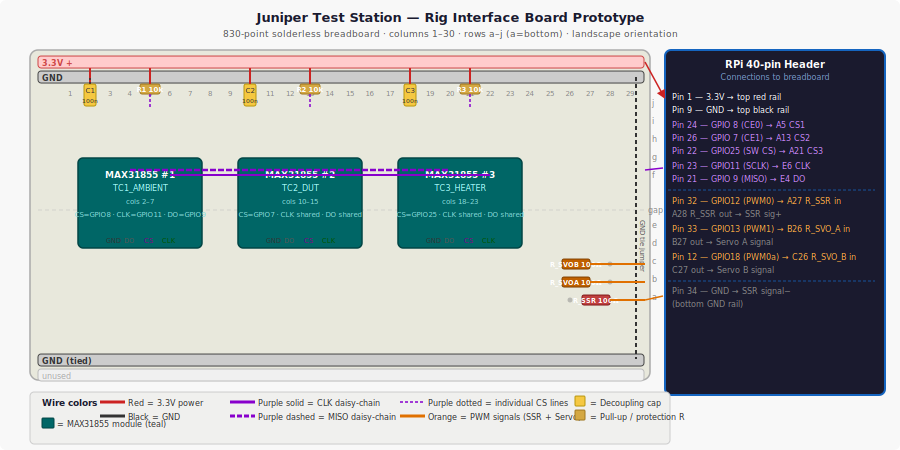

# Breadboard Prototype — Rig Interface Board

> **📄 Print-ready PDF:** [`docs/pdf/breadboard-prototype.pdf`](pdf/breadboard-prototype.pdf)

The diagram above shows every component and wire at exact column/row coordinates. The text below covers placement, external connections, build order, and verification.

---

## Wire Color Convention

- **Red** — 3.3V power positive (MAX31855 VCC)
- **Black** — GND (all rails)
- **Orange** — PWM signal lines (heater SSR control, servo PWM)
- **Green** — digital output lines (not used on this breadboard)
- **Blue** — digital input lines (not used on this breadboard)
- **Purple** — SPI signals (MOSI, MISO, SCLK, and all CS lines)

---

## Coordinate System

**Held in landscape orientation**, long axis left-to-right:

- **Rows** are labeled `a` through `j` along the short edge — **`a` at the bottom**, `j` at the top. The center gap separates rows `e` (bottom half) and `f` (top half).
- **Columns** are numbered `1` through `30` along the long edge — **column `1` on the left**, column 30 on the right.
- A tie point is identified by `<row letter><column number>` — e.g., `E5` is row `e`, column 5 (lower area, left-center).
- Power rails: **top red rail** = 3.3V (outermost above row `j`); **top black rail** = GND (just below top red); **bottom red rail** = unused; **bottom black rail** = GND (tied to top GND rail at column 30).

This breadboard uses a standard 830-point full-size layout (63 column × a–j rows plus two split power rail pairs at top and bottom).

---

## Component Placement

| Component | Breadboard location | Notes |
|-----------|---------------------|-------|
| MAX31855 #1 (TC1_AMBIENT) | Module straddles gap, pins in rows `e`/`f`, columns 2–7 | 8-pin SIP: VCC=E2, GND=E3, DO=E4, CS=E5, CLK=E6. Top row (f) mirrors |
| MAX31855 #2 (TC2_DUT) | Module straddles gap, pins in rows `e`/`f`, columns 10–15 | VCC=E10, GND=E11, DO=E12, CS=E13, CLK=E14 |
| MAX31855 #3 (TC3_HEATER) | Module straddles gap, pins in rows `e`/`f`, columns 18–23 | VCC=E18, GND=E19, DO=E20, CS=E21, CLK=E22 |
| C1 (100nF ceramic) | Vertical: top leg **E2**, bottom leg drops to top GND rail | Decoupling on TC1 VCC — non-polarised, either orientation |
| C2 (100nF ceramic) | Vertical: top leg **E10**, bottom leg drops to top GND rail | Decoupling on TC2 VCC |
| C3 (100nF ceramic) | Vertical: top leg **E18**, bottom leg drops to top GND rail | Decoupling on TC3 VCC |
| R1 (10kΩ CS pull-up, TC1) | Horizontal: **A5** ↔ top red (3.3V) rail at column 5 | Keeps CS1 high at startup; one leg in A5, other to top + rail |
| R2 (10kΩ CS pull-up, TC2) | Horizontal: **A13** ↔ top red rail at column 13 | CS2 pull-up |
| R3 (10kΩ CS pull-up, TC3) | Horizontal: **A21** ↔ top red rail at column 21 | CS3 pull-up |
| R_SSR (100Ω, ¼W) | Horizontal: **A27** ↔ **A28** | GPIO12 → SSR signal+ series resistor; left leg is input, right leg exits east |
| R_SVO_A (100Ω, ¼W) | Horizontal: **A26** ↔ **A27** (shares A27 column bus with R_SSR at row `b`) — place at **B26** ↔ **B27** | GPIO13 → Servo A PWM series resistor |
| R_SVO_B (100Ω, ¼W) | Horizontal: **C26** ↔ **C27** | GPIO18 → Servo B PWM series resistor |

> **Module pin-out note:** Standard MAX31855 breakout boards (Adafruit or clones) expose 5 pins: VCC, GND, DO (MISO), CS, CLK — in that order from left to right. Confirm your specific breakout's silkscreen before inserting. The module body straddles the center gap; pins on the bottom-half rows (`e`) are the ones that matter for wiring since they share column buses with rows `a`–`d`.

---

## External Connections

All wires run from the breadboard to the RPi 40-pin header (or to the off-board SSR/servo terminals) via color-coded Dupont jumpers.

### Power and Ground

| Breadboard tap | Wire color | Destination | Notes |
|----------------|------------|-------------|-------|
| Top red rail | **Red** | RPi pin 1 (3.3V) | Powers all three MAX31855 VCC pins + CS pull-ups |
| Top black rail | **Black** | RPi pin 9 (GND) | Common GND for all modules |
| Top black rail (tie) | **Black** | Bottom black rail at column 30 | Single jumper to extend GND across board |

### SPI Bus (shared by all three MAX31855 modules)

| Breadboard tap | Wire color | RPi pin | BCM GPIO | Notes |
|----------------|------------|---------|----------|-------|
| **E6** (CLK, TC1) + jumpers to E14 and E22 | **Purple** | Pin 23 | GPIO11 (SCLK) | One wire from RPi to E6; short purple jumpers E6→E14 and E14→E22 to daisy-chain CLK |
| **E4** (DO, TC1) + jumpers to E12 and E20 | **Purple** | Pin 21 | GPIO9 (MISO) | Same daisy-chain pattern for MISO |

### Chip-Select Lines (individual per module)

| Breadboard tap | Wire color | RPi pin | BCM GPIO | Notes |
|----------------|------------|---------|----------|-------|
| **A5** (CS, TC1_AMBIENT) | **Purple** | Pin 24 | GPIO8 (CE0) | Hardware SPI CS0 |
| **A13** (CS, TC2_DUT) | **Purple** | Pin 26 | GPIO7 (CE1) | Hardware SPI CS1 |
| **A21** (CS, TC3_HEATER) | **Purple** | Pin 22 | GPIO25 | Software GPIO CS — configure as output, pull high |

### Heater SSR and Servo Outputs

| Breadboard tap | Wire color | RPi pin | BCM GPIO | Notes |
|----------------|------------|---------|----------|-------|
| **A27** (R_SSR input) | **Orange** | Pin 32 | GPIO12 (PWM0) | GPIO12 → R_SSR (100Ω) → SSR signal+ |
| **A28** (R_SSR output) | **Orange** | SSR terminal 3 (signal+) | — | Exits east from breadboard to SSR |
| **B26** (R_SVO_A input) | **Orange** | Pin 33 | GPIO13 (PWM1) | GPIO13 → R_SVO_A (100Ω) → Servo A signal |
| **B27** (R_SVO_A output) | **Orange** | Servo A signal wire | — | Exits east |
| **C26** (R_SVO_B input) | **Orange** | Pin 12 | GPIO18 (PWM0 alt) | GPIO18 → R_SVO_B (100Ω) → Servo B signal |
| **C27** (R_SVO_B output) | **Orange** | Servo B signal wire | — | Exits east |
| Bottom black rail (col 28) | **Black** | SSR terminal 4 (signal−) | — | SSR control GND |

---

## Build Order

Wire colors in **bold** below. Work left to right, power last-connect, power first-disconnect.

1. **Install C1, C2, C3 first** (anchor the decoupling before the ICs go in). Push each 100nF ceramic cap vertically: top leg into **E2**, **E10**, and **E18** respectively; bottom leg drops straight down to the top black (GND) rail. Non-polarised — either orientation. Verify no bridges with adjacent columns.

2. **Insert MAX31855 #1** so VCC is at **E2**, GND at **E3**, DO at **E4**, CS at **E5**, CLK at **E6**. Module body straddles the center gap. Double-check the silkscreen — DO NOT insert backwards. Confirm C1's VCC leg (E2) is on the same column bus as the module's VCC pin.

3. **Insert MAX31855 #2** at columns 10–14 (VCC=E10, GND=E11, DO=E12, CS=E13, CLK=E14). Confirm C2 at E10.

4. **Insert MAX31855 #3** at columns 18–22 (VCC=E18, GND=E19, DO=E20, CS=E21, CLK=E22). Confirm C3 at E18.

5. **Install CS pull-up resistors R1, R2, R3.** Each is 10kΩ. R1: one leg into **A5**, the other leg into the top red rail at column 5. R2: **A13** to top red rail at column 13. R3: **A21** to top red rail at column 21. These hold CS lines HIGH when the RPi is booting or the pin is not yet configured — prevents false SPI transactions.

6. **Wire the SPI bus daisy-chain.**
   - **Purple** jumper: CLK from **E6** (TC1) → **E14** (TC2). Another **purple** jumper: E14 → **E22** (TC3). CLK is now shared.
   - **Purple** jumper: DO (MISO) from **E4** → **E12**. Another **purple** jumper: E12 → **E20**. MISO is now shared.

7. **Install protection resistors R_SSR, R_SVO_A, R_SVO_B** in the columns 26–28 area.
   - R_SSR (100Ω) horizontal at **A27 ↔ A28**.
   - R_SVO_A (100Ω) horizontal at **B26 ↔ B27**.
   - R_SVO_B (100Ω) horizontal at **C26 ↔ C27**.

8. **Connect power rails.** Do NOT connect RPi yet.
   - **Black** jumper: top black rail → bottom black rail at column 30 (GND tie across full board).
   - Verify no shorts across + and − rails with a DMM (continuity mode). Should read open.

9. **Connect RPi power and GND.** With the RPi powered OFF:
   - **Red** wire: RPi pin 1 (3.3V) → top red rail at column 1.
   - **Black** wire: RPi pin 9 (GND) → top black rail at column 1.
   Power on RPi. Measure top red rail = 3.3V, top black rail = 0V. Check E2/E10/E18 all read 3.3V.

10. **Connect all signal wires** per the External Connections tables above. RPi SPI pins last. Clip each Dupont female onto the corresponding RPi pin one at a time, confirming pin number against the 40-pin header diagram before pushing:
    - **Purple** × 3: CS1 (pin 24), CS2 (pin 26), CS3 (pin 22) → A5, A13, A21
    - **Purple** × 2: SCLK (pin 23) → E6; MISO (pin 21) → E4
    - **Orange** × 3: GPIO12 (pin 32) → A27; GPIO13 (pin 33) → B26; GPIO18 (pin 12) → C26
    - **Orange** × 2: A28 → SSR terminal 3; B27 → Servo A signal; C27 → Servo B signal
    - **Black**: bottom black rail → SSR terminal 4 (signal GND)

---

## Verification Checklist

| Stage | What to check | How to check |
|-------|---------------|--------------|
| 1 — Power rail | Top red rail = 3.3V, GND rail = 0V | DMM, probes on rail strips |
| 2 — VCC at modules | E2, E10, E18 all = 3.3V | DMM tip on each tie point |
| 3 — GND at modules | E3, E11, E19 all = 0V | DMM |
| 4 — CS pull-ups | A5, A13, A21 all = 3.3V with RPi booted (before Python runs) | DMM — confirms R1/R2/R3 wired to + rail |
| 5 — SPI CLK daisy | Probe E6, E14, E22 simultaneously while running `spidev` test — all should show same clock waveform | Oscilloscope or logic analyser; or verify each column with DMM in AC mode |
| 6 — MISO continuity | Measure resistance E4→E12→E20 with RPi off — should be <5Ω | DMM continuity across the daisy-chain |
| 7 — TC1 reads | `python3 -c "import board, busio, adafruit_max31855; ..."` returns ambient temp ±5°C | Software test — see `software/test_tc.py` |
| 8 — TC2, TC3 read | Same test for GPIO7 (CS2) and GPIO25 (CS3) | Software |
| 9 — SSR signal | RPi GPIO12 = 3.3V with `gpio write 12 1` (WiringPi) or `raspi-gpio set 12 op dh` | DMM at A28 (R_SSR output) reads 3.3V |
| 10 — Servo signal | GPIO13 and GPIO18 toggle visible on DMM/scope at A28 column area | DMM in frequency mode at B27 / C27 output |
| 11 — No cross-rail shorts | Power off, DMM continuity: top red rail ↔ top black rail → should be OPEN | Any continuity beep = module or component bridge — locate and fix before next power-on |

---

© Juniper Design · <a href="https://juniperdesign.com">juniperdesign.com</a>

