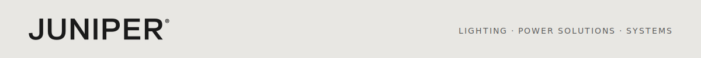

<p align="center"></p>

# Wiring Guide — Automated Test Station

> 📄 **Print-ready PDF:** [`docs/pdf/wiring-guide.pdf`](pdf/wiring-guide.pdf)

This guide covers all wiring for the Juniper Automated Test Station thermal rig: the RPi 4 HMI host, Siemens LOGO! PLC, 4× MAX31855 thermocouple amplifiers, SSR-driven heater, servo-controlled vents, and DUT interface relays.

For instrument-specific wiring (Vitrek V71 HiPot, Siglent SDL1020X-E DC Load), see the respective instrument manuals.

---

## System Block Diagram

```
                      ┌─────────────────────────────────────────────────────┐
                      │           DIN RAIL ENCLOSURE (24V DC)               │
                      │                                                      │
  ┌──────────────┐    │  ┌─────────────────┐   ┌──────────────────────┐     │
  │  RPi 4 HMI   │◄──LAN──►  LOGO! 12/24RCE │   │  24V PSU (DIN rail) │     │
  │  (or NUC PC) │    │  │  Modbus TCP:502  │   │  Meanwell HDR-60-24 │     │
  └──────┬───────┘    │  │                  │   └──────────┬───────────┘     │
         │ USB        │  │  Q1 ──────────────────►SSR → Heater (120VAC)      │
         │            │  │  Q2 ──────────────────►Servo power relay          │
  ┌──────▼───────┐    │  │  Q3 ──────────────────►DUT power relay            │
  │  V71 HiPot   │    │  │  Q4 ──────────────────►Alarm beacon               │
  │  SDL1020X-E  │    │  │  I1 ◄──────────────────E-stop (NC)                │
  └──────────────┘    │  │  I2 ◄──────────────────Door interlock (NC)        │
                      │  │  I3 ◄──────────────────HW overtemp cutout (NO)    │
         │ SPI        │  │  I4 ◄──────────────────Manual start (NO)          │
  ┌──────▼───────┐    │  │  I5 ◄──────────────────Manual stop (NC)           │
  │  4× MAX31855 │    │  └─────────────────┘                                 │
  │  TC amplifiers│   │                                                      │
  │  TC1 Ambient  │   │  ┌──────────────────────────────────────────────┐    │
  │  TC2 DUT      │   │  │  CHAMBER                                      │    │
  │  TC3 Heater   │   │  │  • 150W AC cartridge heater (SSR-switched)    │    │
  │  TC4 Exhaust  │   │  │  • Servo A — intake vent valve                │    │
  └───────────────┘   │  │  • Servo B — exhaust vent valve               │    │
                      │  │  • Bimetallic thermostat 120°C (HW cutout)    │    │
  RPi GPIO 12 ──────────────►SSR signal input                            │    │
  RPi GPIO 13 ──────────────►Servo A PWM                                 │    │
  RPi GPIO 18 ──────────────────►Servo B PWM                             │    │
                      │  └──────────────────────────────────────────────┘    │
                      └─────────────────────────────────────────────────────┘
```

---

## Wire Color Convention

Matches the `automated-drill` project's convention. Use these colors from your wire kit:

| Color      | Signal type                                         |
|------------|-----------------------------------------------------|
| **Red**    | 24V positive, mains live (L), SSR load output       |
| **Black**  | GND, mains neutral (N), common return               |
| **Orange** | PWM signals (heater SSR control, servo PWM)         |
| **Green**  | Digital outputs from LOGO! (relay coil drive lines) |
| **Blue**   | Digital inputs to LOGO! (E-stop, door, sensors)     |
| **Purple** | SPI signals (MOSI, MISO, SCLK) and chip-selects     |
| **Yellow** | I²C / UART communication lines                      |
| **White**  | Shield / chassis GND where needed for noise         |

---

## Power Rails

| Rail        | Source                          | Feeds                                              |
|-------------|---------------------------------|----------------------------------------------------|
| **120V AC** | Mains (wall outlet)             | SSR load side → Heater only. Never inside the DIN rail box. |
| **24V DC**  | Meanwell HDR-60-24 DIN PSU      | LOGO! PLC, relay coils, servo power rail (via Q2)  |
| **5V DC**   | RPi USB-C power supply          | RPi 4 board, MAX31855 modules (via 3.3V LDO onboard) |
| **3.3V DC** | RPi GPIO 3.3V pin (pin 1/17)    | MAX31855 VCC, servo signal pull-ups                |
| **GND**     | Single star point at DIN rail   | All grounds — RPi, LOGO!, PSU, SSR signal          |

> **Safety:** The heater is mains-powered. All mains wiring must be in conduit, properly terminated, and fused. The SSR provides electrical isolation between the low-voltage control circuit and mains. Never expose mains terminals.

---

## RPi 4 → MAX31855 Thermocouple Amplifiers

Uses SPI0 hardware bus. Four MAX31855 modules share SCLK and MISO; each has its own CS line.

| RPi Pin | BCM GPIO | Signal  | Wire   | MAX31855 Pin          | Notes                                 |
|---------|----------|---------|--------|-----------------------|---------------------------------------|
| 23      | GPIO11   | SCLK    | Purple | CLK (all 4 modules)   | SPI clock — daisy-chain to all CSs    |
| 21      | GPIO9    | MISO    | Purple | DO (all 4 modules)    | Data out — daisy-chain to all DOs     |
| 24      | GPIO8    | CE0     | Purple | CS — TC1 (Ambient)    | SPI chip-select 0                     |
| 26      | GPIO7    | CE1     | Purple | CS — TC2 (DUT)        | SPI chip-select 1                     |
| 22      | GPIO25   | GPIO out| Purple | CS — TC3 (Heater)     | Software CS — set GPIO25 as output    |
| 18      | GPIO24   | GPIO out| Purple | CS — TC4 (Exhaust)    | Software CS — set GPIO24 as output    |
| 1       | 3.3V     | VCC     | Red    | VCC (all 4 modules)   | 3.3V — MAX31855 is 3.3V native        |
| 9       | GND      | GND     | Black  | GND (all 4 modules)   | Common GND                            |

### MAX31855 → Thermocouple terminals

Each MAX31855 module has two screw terminals for the K-type thermocouple wires.
K-type convention: **yellow = positive (+), red = negative (−)** (US ANSI standard).

| TC Channel | Location              | Terminal + | Terminal − |
|------------|-----------------------|------------|------------|
| TC1        | Chamber ambient air   | Yellow     | Red        |
| TC2        | DUT mounting surface  | Yellow     | Red        |
| TC3        | Heater element body   | Yellow     | Red        |
| TC4        | Exhaust duct / vent   | Yellow     | Red        |

> **Cold junction:** The MAX31855 has an internal cold-junction compensator. Mount all four modules in the same thermal environment (same DIN sub-rail or common block) to minimise cold-junction error between channels.

### Optional: Thermocouple transmitter for direct LOGO! PLC input

For the prototype, all temperature readings go through the MAX31855 → RPi path. This is sufficient for software-controlled PID and monitoring.

If you want the LOGO! PLC to **independently** read temperatures — for example to implement a hardware temperature interlock in ladder logic without relying on the RPi — you need a **thermocouple transmitter** (also called a TC signal conditioner). This converts the K-type thermocouple's millivolt signal into a 0–10V or 4–20 mA signal that the LOGO!'s analog inputs (AI1–AI4) can read directly.

| Parameter   | Requirement                                                                 |
|-------------|-----------------------------------------------------------------------------|
| Input       | K-type thermocouple                                                         |
| Output      | 0–10V DC or 4–20 mA (match LOGO! AI input range)                           |
| Range       | 0–200°C minimum                                                             |
| Form factor | DIN rail mount preferred (fits alongside LOGO! in enclosure)                |
| Example     | Autonics MTH-D-VK (K-type, 0–10V out) ~$25 · or generic OMEGA TX93A ~$35  |
| Qty         | 1 per thermocouple channel you want the PLC to read independently           |

> **Prototype note:** Transmitters are NOT required for the first build. Add them later if you want hardware-enforced PLC temperature interlocks independent of RPi software. Flag them in the BOM as "production upgrade."

---

## RPi 4 → Heater SSR (GPIO 12)

The RPi GPIO12 drives the signal input of a Fotek SSR-40DA solid-state relay, which switches the 120V AC heater circuit.

| RPi Pin | BCM  | Signal       | Wire   | SSR Terminal | Notes                               |
|---------|------|--------------|--------|--------------|-------------------------------------|
| 32      | GPIO12 | PWM (Heater) | Orange | + (signal+)  | GPIO12 = hardware PWM channel 0     |
| 34      | GND  | GND          | Black  | − (signal−)  | SSR control GND                     |

**SSR load side (mains — by a qualified electrician):**

The complete mains circuit runs through four independent hardware protection layers in series. Each layer operates independently of software and independently of every other layer:

```
Mains Live (L)
  │
  ├──► [3A inline fuse]                     ← protects the branch circuit
  │
  ├──► [E-stop mushroom button, NC]          ← hardwired, bypasses all electronics
  │
  ├──► [LOGO! Q1 relay, NO contacts]        ← safety-gated by ladder logic
  │
  ├──► [Fotek SSR-40DA]                     ← controlled by RPi GPIO12 PWM
  │
  ├──► [Thermal cutoff fuse, 150°C, 10A]   ← clipped directly to heater body
  │     (one-time, passive, no software)
  │
  └──► Heater element (150W, 120VAC)
         │
        Neutral (N)
```

| SSR Terminal | Connects to              | Notes                                                         |
|--------------|--------------------------|---------------------------------------------------------------|
| 1 (AC in)    | Mains Live (L)           | After 3A fuse, after E-stop, after Q1 relay contacts          |
| 2 (AC out)   | Thermal fuse → Heater +  | Thermal fuse in series between SSR output and heater terminal |
| Heater return| Mains Neutral (N)        | Returns neutral directly — SSR switches the live side only    |

**Thermal cutoff fuse spec:**

| Parameter    | Value                                                                      |
|--------------|----------------------------------------------------------------------------|
| Type         | Axial thermal cutoff (TCO) fuse — one-time, non-resettable                 |
| Trip temp    | 150°C (gives ~30°C headroom above the 120°C bimetallic thermostat)         |
| Current      | 10A rated (heater draws 1.25A — heavily derated for long life)             |
| Mounting     | Clip or zip-tie directly to the heater cartridge body — must read element temp, NOT air temp |
| Example part | Bourns SF-0603HIA150C-2 or Microtemp G4A15X (generic 150°C 10A axial)     |
| Cost         | ~$1–2 each — keep 2–3 spares on hand                                       |

> **Important:** A blown thermal fuse means something in the safety chain failed before it. Do not simply replace the fuse and restart — investigate why the element exceeded 150°C before running again.

SSR spec: Fotek SSR-40DA (3–32V DC control, 24–480V AC load, 40A, zero-crossing).
Heater: 150W 120VAC cartridge heater (e.g., Omega CIR-1012/120V or equivalent).
Rated SSR load current at 150W/120V: 1.25A — well within the 40A rating.

---

## RPi 4 → Servo Motors (GPIO 13 / GPIO 18)

Standard 50 Hz PWM servo signal. Pulse width 500–2500 µs = 0°–180°.

| RPi Pin | BCM    | Signal       | Wire   | Servo Wire | Notes                           |
|---------|--------|--------------|--------|------------|---------------------------------|
| 33      | GPIO13 | PWM (Servo A)| Orange | Signal     | Vent A — intake valve           |
| 12      | GPIO18 | PWM (Servo B)| Orange | Signal     | Vent B — exhaust valve          |
| —       | 5V     | VCC          | Red    | Power (+)  | Servo power from LOGO! Q2 relay |
| 34      | GND    | GND          | Black  | GND (−)    | Common GND                      |

> **Servo power:** Servos draw up to 500 mA at stall — do not power from RPi 5V pin (max 50 mA shared). Instead, use LOGO! Q2 relay to switch 24V → 5V step-down (or use a dedicated 5V servo BEC). LOGO! Q2 acts as a safety interlock: servos are only powered when the PLC enables Q2.

---

## LOGO! PLC Wiring

### LOGO! 12/24RCE Terminal Layout

```
     LOGO! 12/24RCE
  ┌───────────────────────┐
  │ I1  I2  I3  I4  I5   │  ← Digital Inputs (24V DC source)
  │ I6  I7  I8            │
  │                        │
  │ Q1  Q2  Q3  Q4        │  ← Relay Outputs (250V AC / 5A)
  │ Q5  Q6  Q7  Q8        │
  │                        │
  │ +24V  0V  AI1  AQ1   │  ← Power + Analog (not used here)
  └───────────────────────┘
```

### Power supply connections

| LOGO! Terminal | Connects to             | Wire  | Notes                          |
|----------------|-------------------------|-------|--------------------------------|
| L+ (+24V)      | PSU +24V output         | Red   | LOGO! supply in                |
| M (0V)         | PSU 0V / GND            | Black | LOGO! supply return            |

### Digital Inputs — I1 through I5

LOGO! inputs are 24V DC source-type (0V = OFF, 24V = ON in default config).
All switches are wired in series with 24V and return to the LOGO! input terminal.

| LOGO! Terminal | Device                        | Wire | Switch type | Active state | Notes                                        |
|----------------|-------------------------------|------|-------------|--------------|----------------------------------------------|
| **I1**         | E-stop mushroom button        | Blue | NC          | LOW = TRIPPED | Break: E-stop pressed = I1 sees 0V = TRIPPED |
| **I2**         | Door reed switch              | Blue | NC          | LOW = OPEN   | Break: door open = I2 sees 0V = interlock    |
| **I3**         | Bimetallic thermostat (120°C) | Blue | NO          | HIGH = TRIPPED| Make: >120°C = I3 sees 24V = HW cutout       |
| **I4**         | Green momentary (start)       | Blue | NO          | HIGH = pressed| Make: button pressed = I4 sees 24V           |
| **I5**         | Red momentary (stop)          | Blue | NC          | LOW = pressed | Break: button pressed = I5 sees 0V = stop    |

**Wiring each input (24V DC NPN-style):**
```
PSU +24V ──► [switch] ──► LOGO! In (I1–I5)
                           LOGO! 0V ──► PSU 0V (common)
```

### Digital Outputs — Q1 through Q4

LOGO! relay outputs are volt-free contacts (SPDT, 250V AC / 5A max).

| LOGO! Terminal | Device                    | Wire  | Load               | Notes                                              |
|----------------|---------------------------|-------|--------------------|----------------------------------------------------|
| **Q1**         | SSR heater relay enable   | Green | SSR signal+ (3–32V DC) | 24V from PSU switched via Q1 → SSR input. Q1 coil energised from LOGO! relay drive. |
| **Q2**         | Servo 5V power rail relay | Green | 24V→5V buck input  | Enables servo power rail via a 24V→5V BEC/DCDC     |
| **Q3**         | DUT power relay           | Green | DUT supply input   | Connects/disconnects power to the DUT under test   |
| **Q4**         | Alarm beacon              | Green | 24V beacon/buzzer  | Energised on fault condition from ladder logic     |

**Q relay output wiring (for 24V DC loads):**
```
PSU +24V ──► LOGO! Q (Com terminal)
LOGO! Q (NO terminal) ──► Load (SSR signal+, beacon, relay coil, etc.)
Load return ──► PSU 0V
```

---

## LOGO! Ladder Logic Specification

> The actual ladder program is written in **LOGO! Soft Comfort** (included on the CD with the PLC). This section specifies the function blocks to implement.

### Safety interlock rung (heater enable)

Heater (Q1) should energise ONLY when ALL of:
- I1 = HIGH (E-stop NOT tripped, NC = normal closed = 24V present)
- I2 = HIGH (Door closed, NC = normal closed = 24V present)
- I3 = LOW (HW thermostat not tripped, NO = normal open = 0V)
- Modbus coil Q1 commanded ON by software

**Ladder rung (LOGO! FBD / LAD notation):**
```
[I1 NO]──[I2 NO]──[I3 NC]──[MB coil from Modbus]──►(Q1 Heater relay)
```
Where `[I1 NO]` = normally-open contact on I1, `[I3 NC]` = normally-closed contact on I3.
This implements a hardware AND gate: heater can only run if all physical conditions are met regardless of software.

### Servo power rung (Q2)

```
[I1 NO]──[I2 NO]──[MB coil Q2 from Modbus]──►(Q2 Servo power relay)
```
Servo power also requires E-stop and door interlock to be satisfied.

### Alarm rung (Q4)

```
[I1 NC]──OR──[I2 NC]──OR──[I3 NO]──►(Q4 Alarm beacon)
```
Alarm fires if E-stop tripped OR door opened OR HW overtemp active.

### Manual start/stop integration

Use LOGO! `SR` (set/reset) block:
- Set: I4 (manual start) OR Modbus coil "run"
- Reset: I5 (manual stop) OR I1 NC (E-stop) OR I2 NC (door) OR I3 NO (overtemp)
- Output: feeds into rung condition for Q1, Q2, Q3

---

## Breadboard Prototype Layout

The rig interface board uses a standard full-size (830-point) solderless breadboard for the prototype phase before PCB fabrication.

**What goes on the breadboard:**
- 4× MAX31855 modules (one per TC channel) — SPI breakout pins
- Pull-up resistors (10kΩ) on each CS line (4×)
- 100nF decoupling capacitor on each MAX31855 VCC pin (4×)
- SSR current-limit resistor R_SSR (100Ω, ¼W, on GPIO12 → SSR+ line)
- Servo signal protection resistors R_SVO (100Ω each, on GPIO13, GPIO18)

**What does NOT go on the breadboard:**
- Mains (120V AC) wiring — always in conduit, by a qualified electrician
- LOGO! PLC — mounts on DIN rail
- PSU — mounts on DIN rail
- SSR — mounts on heatsink on DIN rail or enclosure wall

### Component placement

| Component                | Location               | Notes                                          |
|--------------------------|------------------------|------------------------------------------------|
| MAX31855 #1 (TC1)        | Columns 1–6, top half  | VCC=3.3V, GND, CS=GPIO8, CLK=GPIO11, DO=GPIO9 |
| MAX31855 #2 (TC2)        | Columns 8–13, top half | CS=GPIO7                                       |
| MAX31855 #3 (TC3)        | Columns 15–20, top half| CS=GPIO25 (software CS)                        |
| MAX31855 #4 (TC4)        | Columns 22–27, top half| CS=GPIO24 (software CS)                        |
| C1–C4 (100nF dec.)       | Adjacent to each module VCC | VCC → cap → GND at each module          |
| R1–R4 (10kΩ CS pull-up) | CS pin → 3.3V at each module | Prevents CS floating at startup         |
| R_SSR (100Ω)             | Columns 1–2, bottom    | GPIO12 → SSR+ line                             |
| R_SVO_A (100Ω)           | Columns 4–5, bottom    | GPIO13 → Servo A signal                        |
| R_SVO_B (100Ω)           | Columns 7–8, bottom    | GPIO18 → Servo B signal                        |

### External connections to breadboard

| Tap point      | Wire color | Destination                                |
|----------------|------------|--------------------------------------------|
| + rail (top)   | Red        | RPi 3.3V (pin 1)                           |
| − rail (top)   | Black      | RPi GND (pin 9)                            |
| CS #1 tap      | Purple     | RPi GPIO8 (pin 24)                         |
| CS #2 tap      | Purple     | RPi GPIO7 (pin 26)                         |
| CS #3 tap      | Purple     | RPi GPIO25 (pin 22)                        |
| CS #4 tap      | Purple     | RPi GPIO24 (pin 18)                        |
| SCLK tap       | Purple     | RPi GPIO11 (pin 23)                        |
| MISO tap       | Purple     | RPi GPIO9 (pin 21)                         |
| R_SSR out      | Orange     | SSR terminal (signal+)                     |
| R_SVO_A out    | Orange     | Servo A signal wire                        |
| R_SVO_B out    | Orange     | Servo B signal wire                        |

---

## Power Domain Summary

| Domain   | Source               | Consumers                                          | Fusing              |
|----------|----------------------|----------------------------------------------------|---------------------|
| 120V AC  | Mains wall outlet    | Heater only (via SSR)                              | 3A inline fuse      |
| 24V DC   | Meanwell HDR-60-24   | LOGO! PLC, relay coils, servo BEC input, alarm     | PSU built-in 2.5A   |
| 5V DC    | BEC off Q2 relay     | Servo power rail (2 servos, ~1A peak)              | Q2 relay 5A contact |
| 3.3V DC  | RPi onboard LDO      | MAX31855 modules (4×, ~4 mA each)                  | RPi onboard poly    |
| GND      | Star point at DIN    | All grounds tied at single point                   | —                   |

---

## Safety Notes

1. **Mains wiring:** all 120V AC wiring must be performed by or verified by a qualified electrician. Use appropriate wire gauge (14 AWG for 15A circuit, 16 AWG minimum for 10A sub-circuit), rated connectors, and conduit.
2. **Thermal cutoff fuse:** the 150°C thermal fuse is the last-resort passive protection against heater thermal runaway. It must be physically touching or clamped to the heater element body — not floating in air. It is one-time only: a blown fuse means a safety failure occurred upstream. Investigate before replacing.
3. **E-stop:** the E-stop is a physical hardware interlock wired directly into the 120V heater circuit (in series, before the SSR) AND into the LOGO! input I1. Both layers operate independently. It is NOT a software flag.
4. **HW overtemp cutout:** the bimetallic thermostat disc (120°C trip) wired to I3 is a physical hardware failsafe independent of MAX31855 readings and software PID. Never bypass or remove it.
5. **Four-layer heater protection:** the heater has four independent hardware layers (inline fuse → E-stop → LOGO! Q1 relay → 150°C thermal fuse) plus the software PID cutout. All five must be functional before energising the heater for the first time.
6. **SSR heatsinking:** the Fotek SSR-40DA must be mounted on an aluminium heatsink (≥50 cm²) or the DIN rail enclosure wall. Without a heatsink it will overheat at sustained duty cycles.
7. **Common GND:** all power rails (24V, 5V, 3.3V, SSR signal) must share a single common GND star point. Floating grounds cause measurement noise in the MAX31855 readings.
8. **Servo signal protection:** the 100Ω series resistors on servo PWM lines limit current if a GPIO pin is accidentally set as input — prevents the servo pulling the GPIO low.

---

## PCB Prototype Board

Once the breadboard prototype is validated, the rig interface board will be fabricated using the in-house PCB pipeline (`C:\dev\pcb-fab-pipeline`). See `docs/rig-interface-board/` for:
- `NETLIST.md` — full net-by-net wiring specification
- `BOM.csv` — bill of materials with vendor part numbers
- `board.json` — pcb-fab-pipeline board definition

---

<p align="center"><sub>© Juniper Design · <a href="https://juniperdesign.com">juniperdesign.com</a></sub></p>
